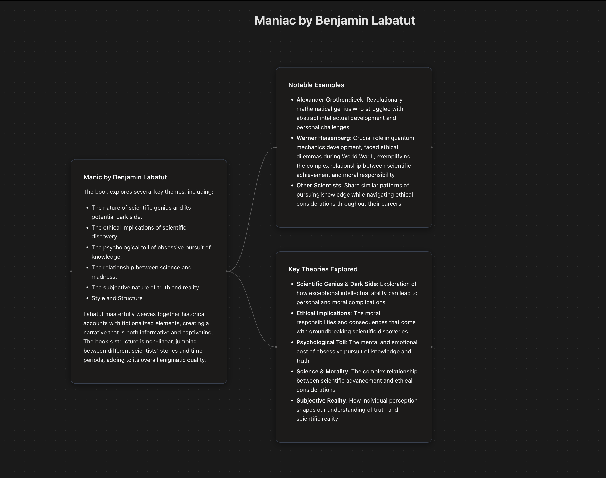

# Tree of Thought Flow


A React Flow visualization application that displays the key themes and concepts from "Manic" by Benjamin Labatut in an interactive flowchart format.

## Features

- **Interactive Flowchart**: Navigate through connected concepts with React Flow
- **Dark Theme**: Modern dark UI with clean styling
- **Markdown Support**: Rich text formatting in nodes with HTML support
- **YAML Configuration**: Easy content management through YAML files
- **Automatic Layout**: Intelligent node positioning based on relationships
- **Responsive Design**: Works on desktop and mobile devices

## Tech Stack

- **React 18** with Vite
- **React Flow** for interactive diagrams
- **ReactMarkdown** with HTML support (rehype-raw)
- **js-yaml** for YAML parsing
- **CSS3** for styling

## Getting Started

### Prerequisites

- Node.js 16 or higher
- npm or yarn

### Installation

1. Clone the repository:
```bash
git clone <your-repo-url>
cd my-react-flow-app
```

2. Install dependencies:
```bash
npm install
```

3. Start the development server:
```bash
npm run dev
```

4. Open your browser and navigate to `http://localhost:5173`

## Project Structure

```
my-react-flow-app/
├── public/
│   ├── graph-data.yaml      # Content configuration
│   └── vite.svg
├── src/
│   ├── App.jsx             # Main application component
│   ├── App.css             # Application styles
│   ├── index.css           # Global styles
│   └── main.jsx            # Entry point
├── package.json
├── vite.config.js
└── README.md
```

## Content Management

Edit the content by modifying `public/graph-data.yaml`:

```yaml
nodes:
  - id: "your-node-id"
    label: "### Your Title
    
    Your content here with **markdown** support and <br/> HTML tags"

edges:
  - id: "connection-id"
    source: "parent-node-id"
    target: "child-node-id"
```

## Customization

### Styling
- Modify colors and theme in `src/App.css` and `src/index.css`
- Adjust node styling in the `CustomNode` component

### Layout
- Change spacing by modifying `HORIZONTAL_SPACING` and `VERTICAL_SPACING` constants
- Adjust default viewport zoom and position in the `defaultViewport` prop

### Content
- Update `public/graph-data.yaml` to change the flowchart content
- Add new nodes and connections following the existing structure
